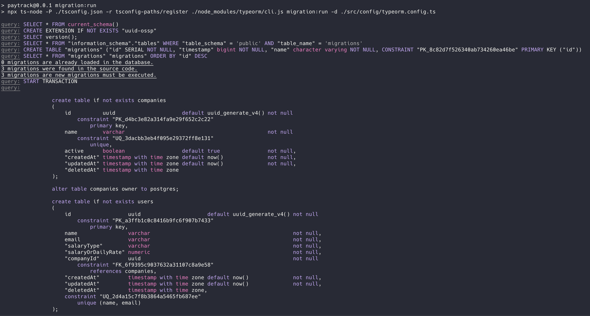
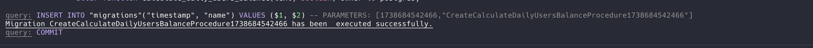
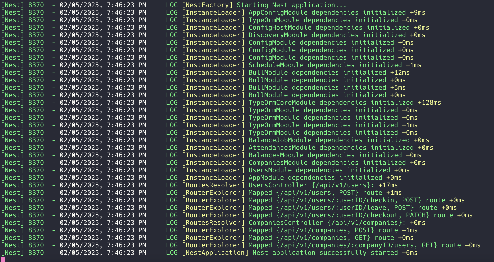
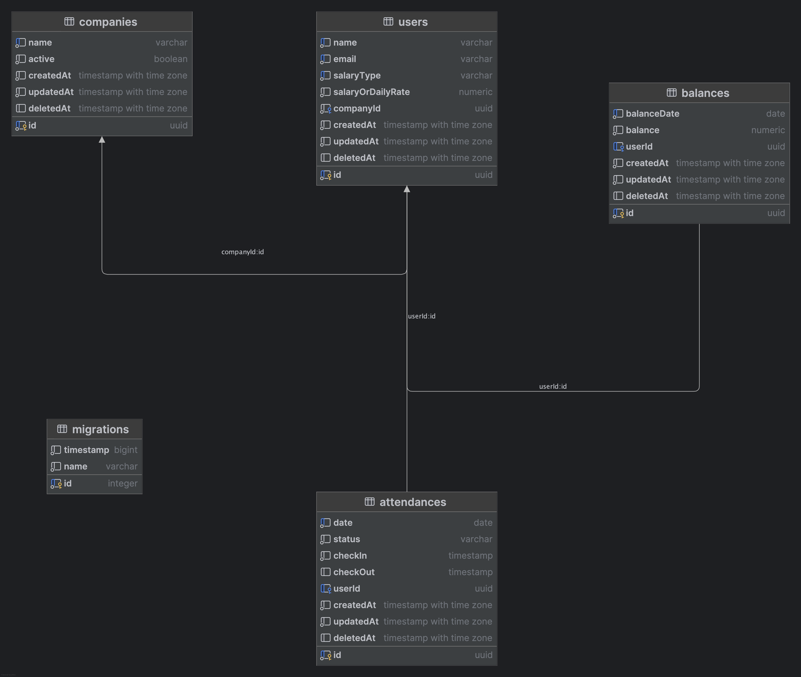

# Paytrack

This system is responsible for calculating and updating the salary balances of employees, both for **monthly** and **daily** salaried workers. It processes attendance data and ensures accurate payroll management. It integrates with **PostgreSQL** for data storage and leverages **NestJS** for API management, running scheduled tasks daily to ensure balances are up-to-date.

To ensure scalability and performane, the applications follows a distributed architecture and asynchronous task handling via **Publish/Subscribe** pattern using **BullMQ**. BullMQ is message queue facilitator, provided by **NestJS** which uses Redis as the storage medium. It provides blazing fast task scheduling and retrieval. The application also emphasizes on database optimzations by using composite indexes and functions for salary balance updation logic.

Also, the APIs are RESTful and stateless, which are ideal for scalability.

The heart of this application is the Cron job, which runs every midnight (_configurable via .env for testing_). It takes into account the attendance of current month for all users until the previous day. All those attendances are taken into consideration to evaluate which users (monthly/daily) are eligible for balance update.

For each company, all employees who are considered for a day pay for yesterday, are batched into jobs of a specific size (.env file) by company. For scalability, the monthly users jobs are enqueued into a 'monthly_users' queue and daily users jobs are enqueued into a 'daily_workers' queue.

Additionally there are 2 job workers(_having a concurrency of 4 each_) each for 'monthly_users' and 'daily_users' queue which dequeue one job at a time, and run a database function to update the balances. The balance updation functionality is offloaded to the database function, which provides a means for scalable solution.

---

## Table of Contents

- [Overview](#overview)
- [System Requirements](#system-requirements)
- [Installation](#installation)
- [API Endpoints](#api-endpoints)
- [Database Schema](#database-schema)
- [Unit tests](#unit-tests)
- [Future Enhancements](#future-enhancements)

---

## Overview

The **Employee Balance Calculation System** calculates employee balances daily based on:

- **Monthly Salaried Employees**: The salary is calculated based on working days in a month.
- **Daily Salaried Employees**: The salary is calculated based on actual attendance (must work 9+ hours to count as a paid day).

It works by:

1. Fetching the attendance records from the **attendances** table.
2. Calculating the per-day salary for monthly employees and the total balance for each employee.
3. Updating the balance for each employee in the **balances** table, either by updating an existing balance or creating a new record if no balance exists for the month.

---

## System Requirements (**Mandatory**)

Please make sure that below are installed before proceeding to [Installation](#installation) section

- **PostgreSQL 12+** - PostgreSQL database
- **Node.js (v16+)** - Install Node on local machine
- **NestJS** - Install CLI

---

## Installation

### NOTE

Please make sure you have a running instance of PostgreSQL database and Redis instance either locally/remotely.

### 1. Clone the repository

```bash
git clone https://github.com/ilivestrong/paytrack
```

### 2. Provide .env file

- Using the terminal, change the directory to the root of the project.
- Create a **.env** file without below settings.
- First 5 keys are for setting up database.
- The JOB*BATCH_SIZE value specifies the about of user entries per job that would be processed by job worker. \_For example, if we have 500K users, 1000 would be ideal. For testing 10 or 100 may be ideal.*
- Next 2 keys are for setting up Redis instance
- The last key: **CRON_EXPRESSION** specific the frequency of cron.  
  _If nothing is specified here, it would by default be every midnight. In the example it is set to 10 seconds for testing purpose._

_Make sure database name should be same that you created earlier._

```bash
DBHOST='localhost'
DBPORT=5432
DATABASE='testdb1'
USERNAME='postgres'
PASSWORD='postgres'

JOB_BATCH_SIZE=1000

REDIS_HOST=localhost
REDIS_PORT=6379

CRON_EXPRESSION=*/10 * * * * *
```

### 3. Install dependencies

The next step is to install project dependencies listed in package.json. Run the below command to install them.

```bash
npm install
```

### 3. Run database migrations

The next step is to create database tables and functions via a SQL script. We leverage **typeorm** to interact with our PostgreSQL database.

Please run below migration commands in your terminal from the root of the project directory:

```bash
npm run migration:run
```

You should see a success message at the end.



### 4. Run the application

Next step is to run the application. Please run below command in the terminal.

```bash
npm run start:dev
```

You should see something like this upon successfull run.


The application will first setup a HTTP server with various API endpoints to create:

- Company
- User
- Attendance (via checkin/checkout/apply leave)

> These endpoints will allow you to first setup the companies, create associated monthly/daily user(s). And then peform checkin/checkout/apply leave operations.

> Secondly, a cron will be setup to run based on cron expression(or default every midnight). The cron upon execution will fetch users who are eligible for previous day pay(_based on rules_) company wise. Then it will create batches of job for monthly and daily users separately for balance updation. The associated job workers (4 concurrent workers), will consume these jobs and initiate monthly/daily balance update functions in PostgreSQL database.

> NOTE: **To test the results, the data will have to be validated by running appropriate commands in PostgreSQL database.**

## api-endpoints

The first step is to create a company.

### Company

- To create a company, use below endpoint:

```bash
POST http://localhost:3000/api/v1/companies
Content-Type: application/json

Request
{
    "name": "Central Retail"
}
```

Response: **201 Created**

```json
{
  "name": "Central Retail",
  "id": "a7c51af5-7b3e-47ab-b9cd-c7469fe1d08b",
  "createdAt": "2025-02-05T12:27:20.678Z",
  "updatedAt": "2025-02-05T12:27:20.678Z",
  "deletedAt": null,
  "active": true
}
```

### User

To create a user for a company use below endpoint.

- The 'salaryType' can be either 'monthly' or 'daily'.
- The 'salaryOrDailyRate' contains either base salary for monthly user or daily rate for daily user.
- The 'companyId' is the id of the company for which we are creating the user.

```bash
POST http://localhost:3000/api/v1/users
Content-Type: application/json

Request
{
    "name": "Tim Smith",
    "email": "tim.smith@gmail.com",
    "salaryType": "daily",
    "salaryOrDailyRate": 112.89,
    "companyId": "a7c51af5-7b3e-47ab-b9cd-c7469fe1d08b"
}
```

Response: **201 Created**

```json
{
  "name": "Tim Smith",
  "email": "tim.smith@gmail.com",
  "salaryType": "daily",
  "salaryOrDailyRate": 112.89,
  "company": {
    "id": "a7c51af5-7b3e-47ab-b9cd-c7469fe1d08b"
  },
  "id": "d2b2f023-b6a7-4654-99d1-3c773181a80c",
  "createdAt": "2025-02-05T12:39:43.440Z",
  "updatedAt": "2025-02-05T12:39:43.440Z",
  "deletedAt": null
}
```

### Checkin

The checkin endpoint marks checkin time for a user (monthly/daily). The userId has to be provided as a param in the endpoint URI.

```bash
POST http://localhost:3000/api/v1/users/d2b2f023-b6a7-4654-99d1-3c773181a80c/checkin
Content-Type: application/json
Content-Length: 184

```

Response: **201 Created**

```json
{
  "success": true
}
```

### Apply leave

For testing purpose the app allows the monthly user to apply for a leave. The userId has to be provided as a param in the endpoint URI.

```bash
POST http://localhost:3000/api/v1/users/d2b2f023-b6a7-4654-99d1-3c773181a80c/leave
Content-Type: application/json

```

Response: **201 Created**

```json
{
  "success": true
}
```

### Checkout

The checkout endpoint marks checkout time for a user (monthly/daily). The **userId** has to be provided as a param in the endpoint URI. This endpoint is only required for a daily user for them to mark their shift end time. Their balance solely depends upon the total work hours in a day, which is checkout time - check in time. It should be greater or equal to 9 hours, else they won't be paid for the day.

##### Testing Purpose

There is an optional 'test' querystring variable that can be provided. If true, the API will add 10 hours to checkin time of the user as checkout time, so that the daily user becomes eligible for yesterday's day pay.

```bash
PATCH http://localhost:3000/api/v1/users/d2b2f023-b6a7-4654-99d1-3c773181a80c/checkout?test=true
Content-Type: application/json

```

Response: **200 OK**

```json
{
  "success": true
}
```

## database-schema



### Table relationships

- #### Company -> 0..n Users

- User -> 0..n Attendances

- User -> 0..n Balances

## unit-tests

Due to shortage of time, unit tests weren't implemented.

## future-enhancements

This solution isn't perfect as it is restricted to a certain scope only.

- In a typical scenario, there must be daily data injection from various companies into our system. In lieu of that, API endpoints have been provided to create such data yourself.

- Secondly, in real world, where we millions/billions of DAU (daily active users), we may go for more robust and distributed systems like Kafka.

- Thirdly, horizonally scaling the database could be next step, so sharding the datbase would be ideal.

- Moreover, instead of NestJS workers, we may have AWS Lambda functions that scale as per the number of jobs.
